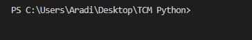

# 💡 Hello World Effects Showcase

Welcome to the ultimate **"Hello, world!"** visual effects showcase — a collection of animated text effects written in Python using the `colorama` library for terminal color and style control.

This project is a creative playground for practicing **Python scripting**, **animation logic**, **terminal manipulation**, and **unicode/multilingual character handling**. Whether you're into cybersecurity, programming, or just love terminal art, this is a fun way to flex your skills.

---

## 🎬 Features

Each effect creatively displays `"Hello, world!"` (or its equivalent) using a different visual style:

- **Typing Effect** — Types text with occasional typos and corrections
- **Flash Effect** — Text blinks on and off like a neon sign
- **Random Reveal** — Characters appear in random order
- **Shadow Effect** — Binary-style text with shadow
- **Neon Glow** — Animated glow using bright colors
- **Matrix Effect** — Inspired by the "Matrix" digital rain
- **Fire Effect** — Flickering flame-style text in warm colors
- **Typing/Deletion** — Simulates typing and erasing
- ... and many more:
  - Vertical print
  - Shatter (text jumble)
  - Earthquake (shaky screen)
  - Morse code output
  - Searchlight scanner
  - Countdown-to-reveal

Each effect runs for a few seconds before moving to the next one, and the screen is cleared between them for dramatic effect.

---

## 🧠 What I Learned

This project helped me build a deeper understanding of:

- `time.sleep()` for frame control and animations
- `colorama` for terminal styling
- `random` for shuffling and chaos effects
- `os.system('cls'/'clear')` for terminal control
- Unicode and multilingual terminal support (e.g., Russian, Chinese)
- String slicing, encoding patterns (binary & Morse), and creative logic

---

## ⚙️ Requirements

- Python 3.x
- `colorama` (Install with `pip install colorama`)

---

## 🚀 How to Run

1. Clone the repo or download the script.
2. Install the required library:
   ```bash
   pip install colorama
3. Run the script:
   ```bash
   Hello_world.py 
Each effect will run in sequence. Press Enter at the end to exit.

---

## 📸 Preview



---

## 🧩 To-Do / Ideas for Expansion
- Add user input to select which effects to run
- Add CLI flags for speed or color customization
- Export effects as GIFs for social media
- Add sound effects (e.g., typing or beeping)
- Turn this into a mini terminal "demo reel"

---

## 📜 License
MIT License — free to use, modify, and share with proper credit.

---

## 🙋‍♀️ About the Author
Lindsey Armstrong
Aspiring ethical hacker and cybersecurity analyst

🔗 [LinkedIn](https://www.linkedin.com/in/WhoIsLindseyArmstrong/)
🌐 [My Portfolio Website](whoislindseyarmstrong.tech)

✨ "Sometimes learning starts with a little fun — even just saying 'Hello, world!' with flair."
